<div align="center">

# ✈️ Flight Reservation System

### *A Modern, Enterprise-Ready Flight Search, Booking & Airline Fleet Management Portal*

[](https://dotnet.microsoft.com/)
[](https://docs.microsoft.com/en-us/dotnet/csharp/)
[](https://dotnet.microsoft.com/apps/aspnet/mvc)
[](https://docs.microsoft.com/ef/core/)
[](https://www.microsoft.com/sql-server/)
[](https://getbootstrap.com/)
[](LICENSE)

<br />

<p align="center">
  <a href="#-key-features">Key Features</a> •
  <a href="#-application-walkthrough--screenshots">Screenshots</a> •
  <a href="#-tech-stack--architecture">Tech Stack</a> •
  <a href="#-quick-start">Quick Start</a> •
  <a href="#-default-credentials">Demo Accounts</a> •
  <a href="#-project-structure">Project Structure</a>
</p>

---

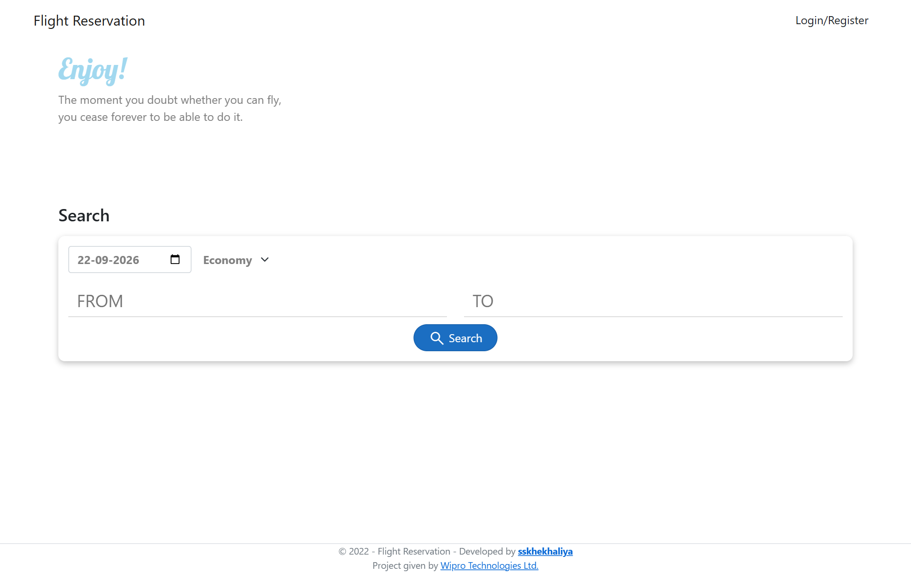

</div>

<br />

## 📖 Overview

**Flight Reservation** is a full-featured web application designed to simulate modern commercial airline operations and passenger ticketing workflows. Built on the modern **.NET 10** platform using **ASP.NET Core MVC** and **Entity Framework Core**, it delivers high-performance database transactions, role-based security with **ASP.NET Identity**, dynamic fare calculations, integrated user digital wallets, and automated on-demand **PDF E-Ticket** generation via **Rotativa**.

---

## ✨ Key Features

### 👤 Passenger Experience
- **Smart Flight Search**: Real-time filtering by departure date, origin airport, destination airport, and cabin tier (Economy & Business).
- **Dynamic Pricing & Tax Computation**: Automatic calculation of base airfare, duration, and GST (18%) with real-time grand total breakdown.
- **Integrated Digital Wallet**: Personal cashless wallet system allowing passengers to add funds, track transaction balances, and complete instant ticket checkouts.
- **Instant Seat Inventory Allocation**: Atomic decrementation of available seats upon successful booking with protection against overbooking.
- **PDF E-Ticket Generation**: Downloadable, print-ready digital boarding passes rendered directly to PDF format via Rotativa (`wkhtmltopdf`).
- **Booking History**: Real-time overview of all upcoming journeys with complete travel and passenger metadata.

### 🛡️ Administrative Portal
- **Executive Dashboard**: Clean, responsive management command center with intuitive navigation to fleet, schedules, and reservations.
- **Airline & Fleet Management**: Full CRUD capabilities for carrier profiles, flight numbers, airline branding/logos, and aircraft specifications.
- **Route Scheduling & Inventory Dispatcher**: Interactive schedule planner equipped with Select2 searchable dropdowns to set flight routes, boarding/departure timestamps, seat quotas, and cabin-specific fares.
- **Centralized Bookings Ledger**: Live monitor of all confirmed reservations across all passengers with deep-dive inspection views.
- **Role-Based Security**: Strict role enforcement (`[Authorize(Roles = "Admin")]`), lockout protection on repeated failed logins, and cookie encryption.

---

## 📸 Application Walkthrough & Screenshots

### 🌟 Passenger Journey

| 1. Intelligent Flight Search | 2. Real-Time Flight Results |
|:---:|:---:|
|  | 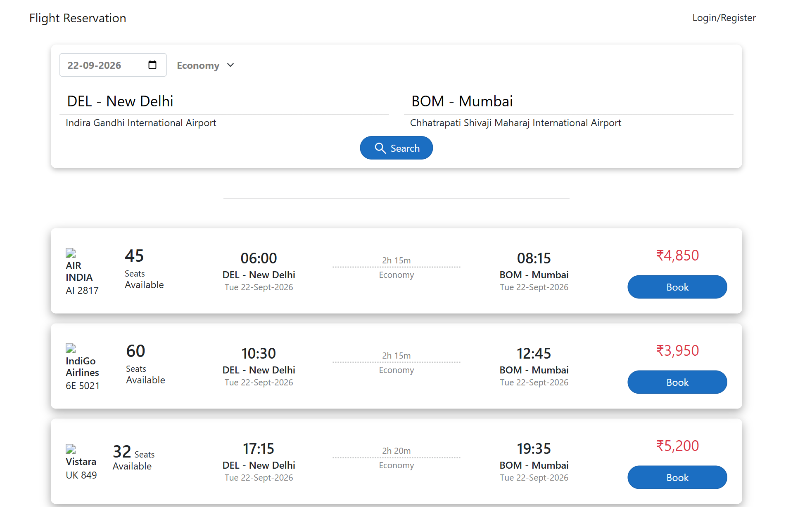 |
| *Intuitive search bar with airport autocomplete* | *Live airline cards, seat counts, durations & fares* |

| 3. Seamless Checkout & Price Breakdown | 4. Digital Passenger Wallet |
|:---:|:---:|
| 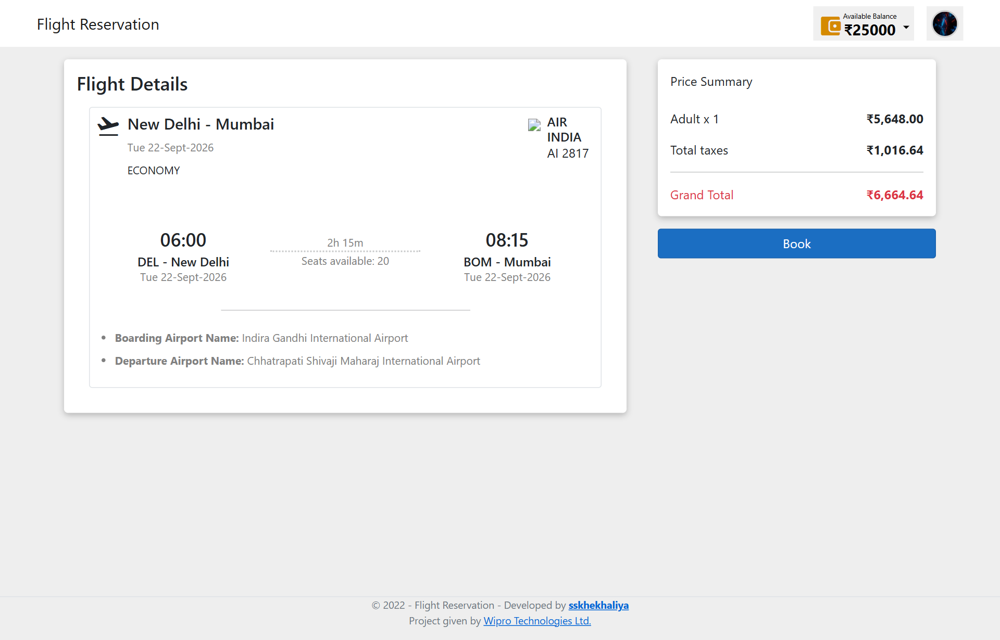 | 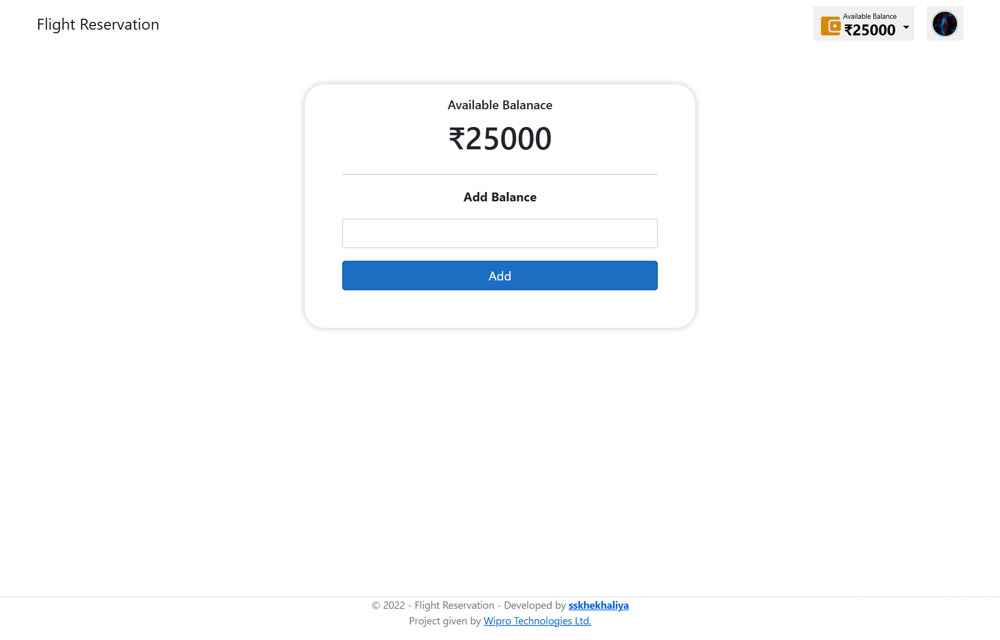 |
| *Detailed flight overview, airport data & tax breakdown* | *Instant cashless wallet top-up and live balance sync* |

| 5. Booking Confirmation | 6. Passenger Orders & E-Tickets |
|:---:|:---:|
| 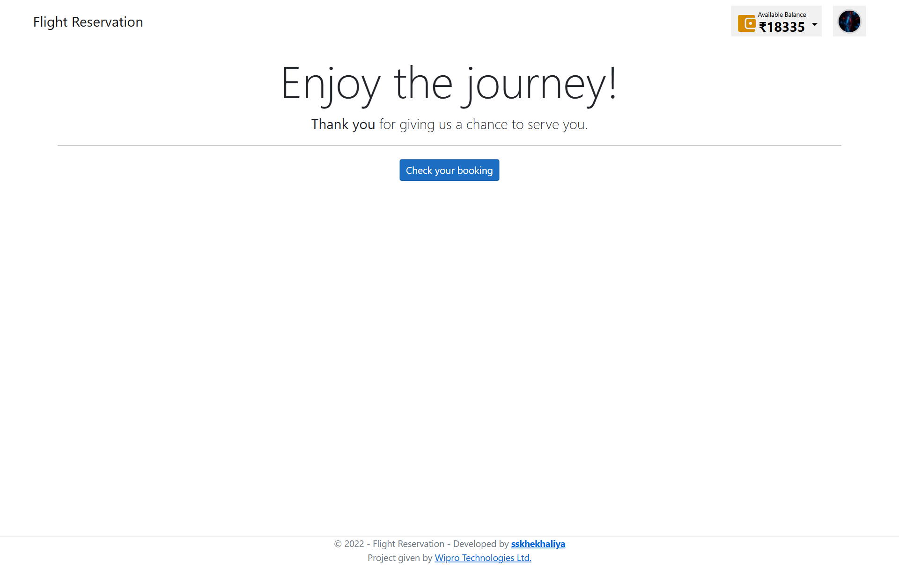 | 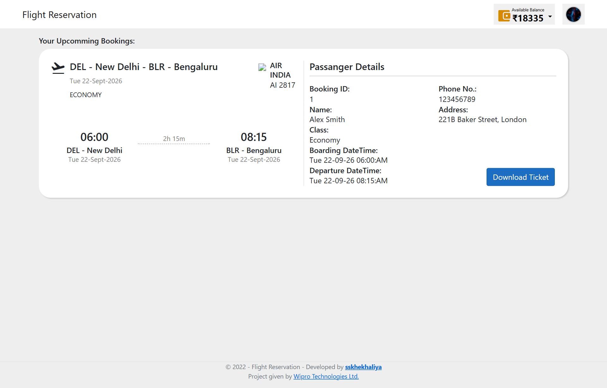 |
| *Instant payment deduction & seat confirmation* | *View travel itineraries & download PDF boarding passes* |

---

### 💼 Admin Control Center

| 1. Admin Management Dashboard | 2. Interactive Route Scheduler |
|:---:|:---:|
| 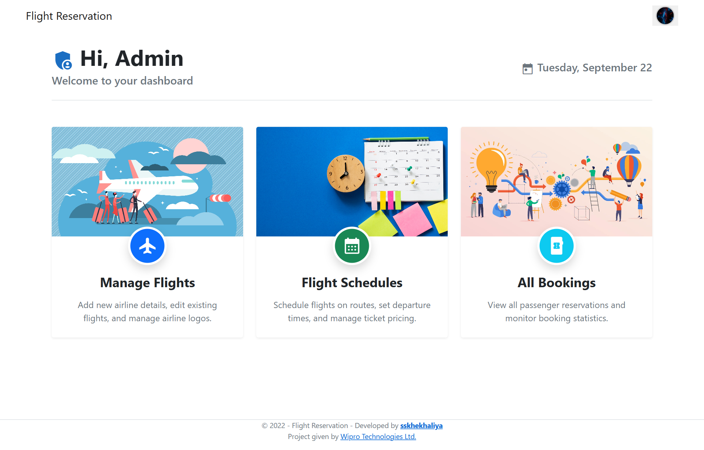 | 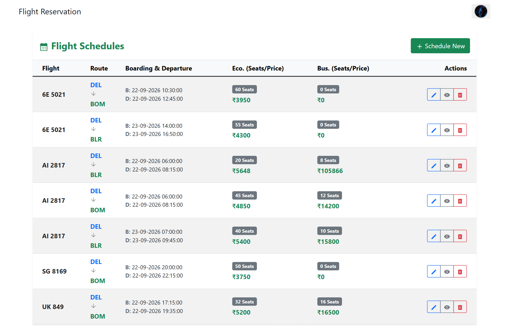 |
| *Centralized hub for airline operations* | *Filterable schedules with route badges & pricing* |

| 3. Fleet & Airline Management | 4. Reservation Ledger & Deep Dive |
|:---:|:---:|
| 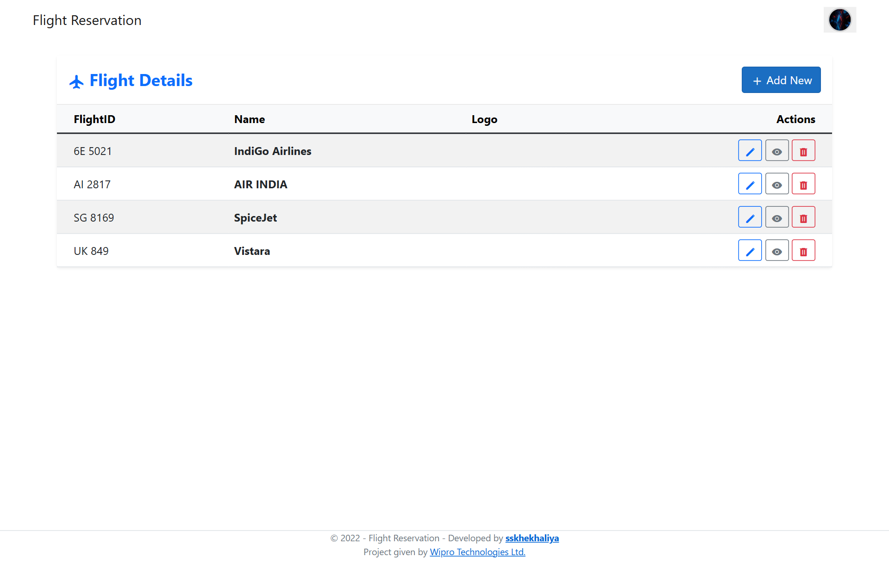 | 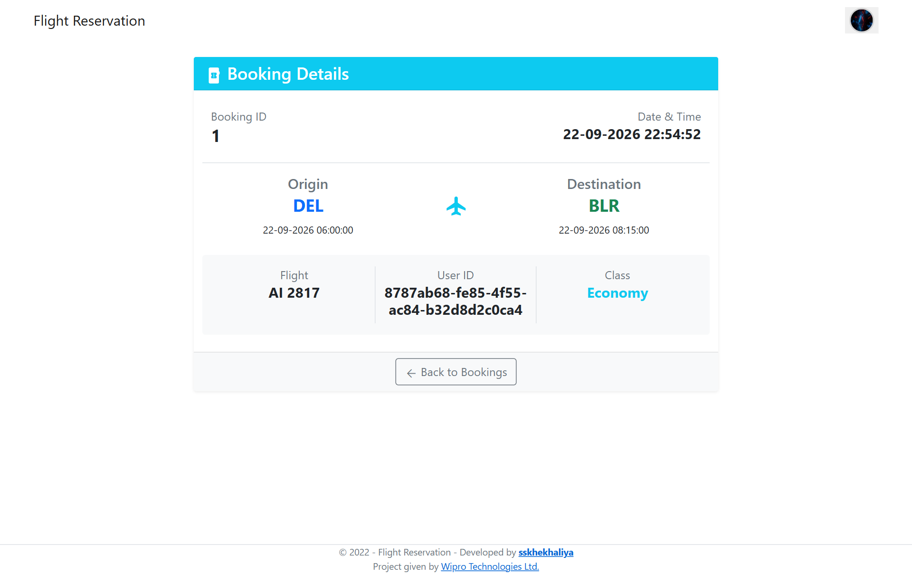 |
| *Manage carriers, flight IDs, and logos* | *Inspect traveler details, timestamps & ticket status* |

---

## 🛠️ Tech Stack & Architecture

### Backend & Frameworks
- **Runtime**: [.NET 10.0](https://dotnet.microsoft.com/)
- **Architecture**: Model-View-Controller (ASP.NET Core MVC)
- **Data Access & ORM**: [Entity Framework Core 10](https://docs.microsoft.com/ef/core/) (Code-First Migrations)
- **Database Engine**: Microsoft SQL Server
- **Identity & Security**: ASP.NET Core Identity with PBKDF2 Password Hashing & Role Claims
- **PDF Engine**: [Rotativa.AspNetCore](https://github.com/webgio/Rotativa.AspNetCore) (Headless WebKit-based `wkhtmltopdf`)

### Frontend & UI
- **Styling**: Bootstrap 5.1 & Custom CSS3
- **Icons & Typography**: Google Material Symbols & Lobster Web Font
- **Client Interactivity**: jQuery 3.6, jQuery Validation, Unobtrusive Validation, Select2

### Entity Relationship Model

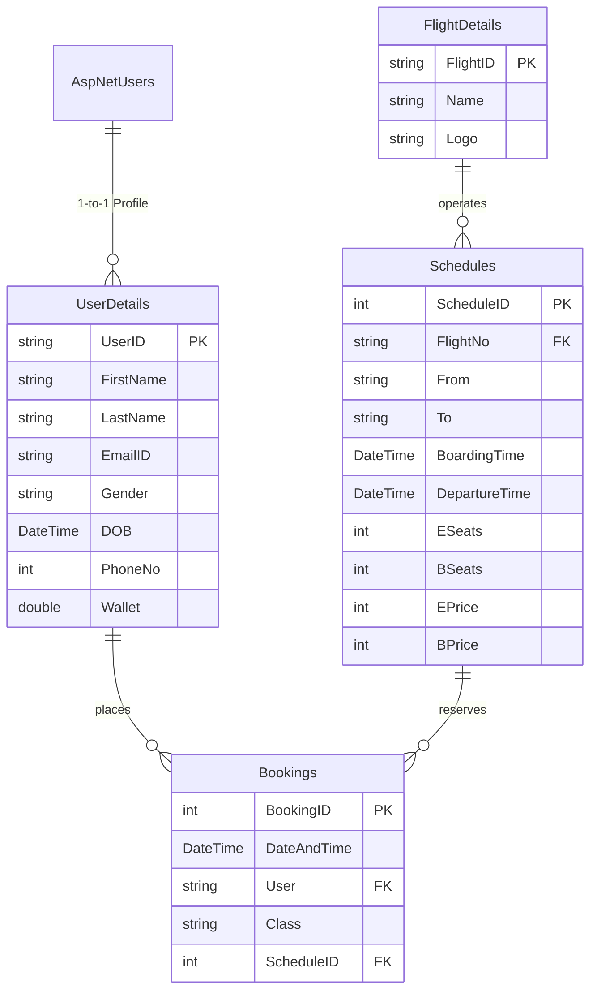

---

## 🚀 Quick Start

### 📋 Prerequisites
Make sure you have the following installed on your machine:
- [.NET 10.0 SDK](https://dotnet.microsoft.com/download/dotnet/10.0) (or later)
- [Microsoft SQL Server](https://www.microsoft.com/sql-server/sql-server-downloads) (Express, Developer, or LocalDB)
- [Git](https://git-scm.com/)

---

### ⚙️ Installation & Setup

1. **Clone the repository**:
   ```bash
   git clone https://github.com/sskhekhaliya/FlightReservation.git
   cd FlightReservation
   ```

2. **Configure Database Connection**:
   Open `FlightReservation/Data/ApplicationDbContext.cs` and verify the connection string matches your local SQL Server instance:
   ```csharp
   optionsBuilder.UseSqlServer(@"Server=localhost;Database=FlightReservation;Trusted_Connection=True;TrustServerCertificate=True;");
   ```

3. **Apply Database Migrations & Seed Default Data**:
   Run the EF Core tool to create the database schema:
   ```bash
   dotnet ef database update --project FlightReservation
   ```
   > 💡 *On the very first launch, `SeedData.cs` automatically seeds the `Admin` role, sample airlines, flights, routes, and initial test accounts.*

4. **Launch the Application**:
   ```bash
   dotnet run --project FlightReservation
   ```

5. **Open in Browser**:
   Navigate to [http://localhost:5000](http://localhost:5000).

---

## 🔑 Default Credentials

For quick evaluation, the database is pre-seeded with ready-to-use accounts:

| Role | Email Address | Password | Initial Privileges / Balance |
| :--- | :--- | :--- | :--- |
| **Administrator** | `admin@flight.com` | `AdminPassword123!` | Full Admin Panel, Fleet, Schedule & Booking Access |
| **Demo Passenger** | `passenger@flight.com` | `UserPassword123!` | Passenger Portal, ₹25,000 Seeded Wallet Balance |

---

## 📂 Project Structure

```
FlightReservation/
├── FlightReservation.sln              # Visual Studio Solution File
├── docs/
│   └── screenshots/                   # Application screenshots & UI captures
└── FlightReservation/
    ├── Controllers/                   # MVC Action Controllers
    │   ├── AccountController.cs       # Login, Registration & Authentication
    │   ├── BookingsController.cs      # Admin Booking Ledger & Inspection
    │   ├── FlightDetailsController.cs # Airline Fleet & Carrier CRUD
    │   ├── HomeController.cs          # Public Landing & Flight Search
    │   ├── InfoController.cs          # Booking Transaction & Wallet Settlement
    │   ├── SchedulesController.cs     # Route Scheduling & Fare Allocation
    │   ├── UserController.cs          # Wallet Management, Checkout & Orders
    │   └── UserDetailsController.cs   # Passenger Profile Management
    ├── Data/
    │   ├── ApplicationDbContext.cs    # EF Core Identity Database Context
    │   └── SeedData.cs                # Automatic Seeder for Roles & Accounts
    ├── Models/                        # Domain & Database Entities
    │   ├── Booking.cs                 # Ticket Reservation Record
    │   ├── FlightDetail.cs            # Aircraft / Carrier Profile
    │   ├── Schedule.cs                # Route, Timing & Fare Matrix
    │   └── UserDetail.cs              # Passenger Profile & Wallet Ledger
    ├── ViewModels/                    # Form & Data Transfer Objects
    │   ├── LoginViewModel.cs          # Credential DTO
    │   └── RegisterViewModel.cs       # Passenger Sign-up DTO
    ├── Views/                         # Razor MVC Views
    │   ├── Account/                   # Login & Registration Pages
    │   ├── Bookings/                  # Admin Reservation Views
    │   ├── FlightDetails/             # Airline Fleet Management Views
    │   ├── Home/                      # Search Portal & Admin Dashboard
    │   ├── Info/                      # Transaction State Views (Success, Error)
    │   ├── Schedules/                 # Flight Timetable & Dispatch Views
    │   ├── User/                      # Booking Checkout, Wallet & Orders
    │   └── Shared/                    # Layouts & Navigation Components
    └── wwwroot/                       # Static Assets (CSS, JS, Fonts & Rotativa)
```

---

## 🤝 Contributing

Contributions, bug reports, and feature requests are welcome!
1. Fork the Project
2. Create your Feature Branch (`git checkout -b feature/AmazingFeature`)
3. Commit your Changes (`git commit -m 'Add some AmazingFeature'`)
4. Push to the Branch (`git push origin feature/AmazingFeature`)
5. Open a Pull Request

---

## 📄 License

This project is licensed under the MIT License - see the [LICENSE](LICENSE) file for details.

---

## 👨‍💻 Author & Acknowledgements

- **Developer**: **[sskhekhaliya](https://www.sskhekhaliya.in/)**
- **Project Initiative**: Assigned by **[Wipro Technologies Ltd.](https://www.wipro.com)**

